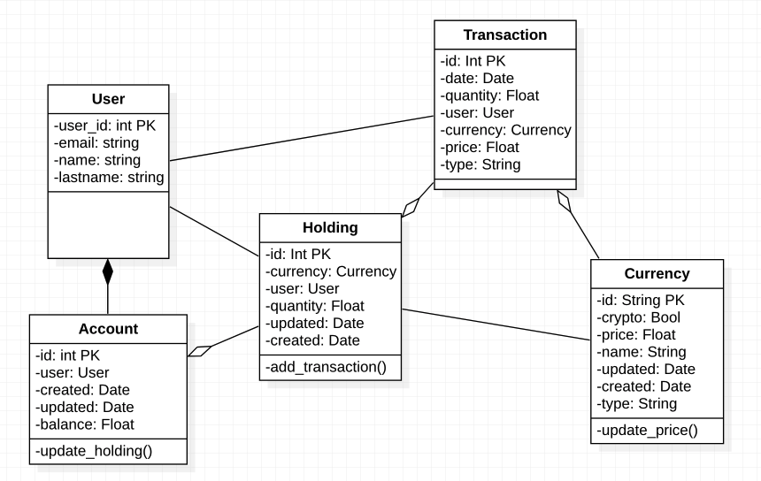

# The First Moneyes Prototype
##Accounts
### Admin account
username : user@admin.fr  
password : RXEZ62vH7Ut9abS  
### User account
> You can use this user to test Moneyes like a Demo. This user already have transactions, assets, etc.

username : user@normal.fr  
password : RXEZ62vH7Ut9abS  
## Pages
###Account
- [Log In](http://tomguastapaglia.pythonanywhere.com/accounts/login/)  
- [Sign up](http://tomguastapaglia.pythonanywhere.com/accounts/signup/)  
- [Change password](http://tomguastapaglia.pythonanywhere.com/accounts/password/)  
###Application
- [Home](http://tomguastapaglia.pythonanywhere.com/)  
- [Dashboard](http://tomguastapaglia.pythonanywhere.com/dashboard/)  
- [Market Prices](http://tomguastapaglia.pythonanywhere.com/dashboard/currencies)  
- [Wallets](http://tomguastapaglia.pythonanywhere.com/dashboard/wallets)  
- [Assets](http://tomguastapaglia.pythonanywhere.com/dashboard/assets)  
- [Transactions](http://tomguastapaglia.pythonanywhere.com/dashboard/transactions)  

You can add a new transaction here [Add new transaction](http://tomguastapaglia.pythonanywhere.com/dashboard/transaction/add). You can select :
- Date
- Quantity
- Currency (only 4 available)
- Purchase price
After save it, new price is automatically get, and you can track your performance at 'home' page

## The project
This project is given by Moneyes and this is the first version of Moneyes Application.
This prototype is to practice and test open-banking API.
## Use Case Diagram

## Class Diagram

