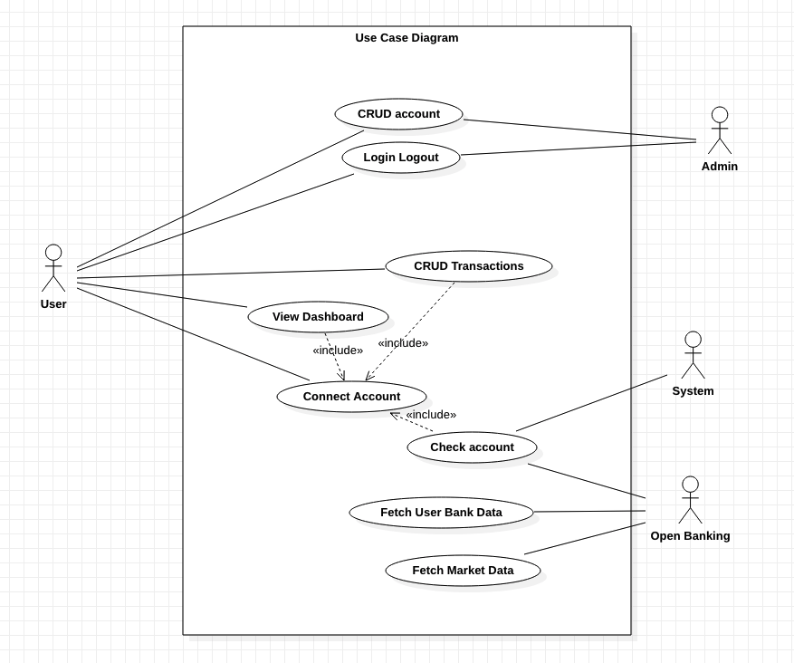

# The First Moneyes Prototype
##Accounts
### Admin account
username : user@admin.fr  
password : RXEZ62vH7Ut9abS  
### User account
username : user@normal.fr  
password : RXEZ62vH7Ut9abS  
## Pages
###Account
- [Log In](http://localhost:8000/accounts/login/)  
- [Sign up](http://localhost:8000/accounts/signup/)  
- [Change password](http://localhost:8000/accounts/password/)  
###Application
- [Home](http://localhost:8000/)  
- [Dashboard](http://localhost:8000/dashboard/)  
- [Market Prices](http://localhost:8000/dashboard/currencies)  
- [Wallets](http://localhost:8000/dashboard/wallets)  

## The project
This project is given by Moneyes and this is the first version of Moneyes Application.
This prototype is to practice and test open-banking API.
## Use Case Diagram

## Class Diagram

